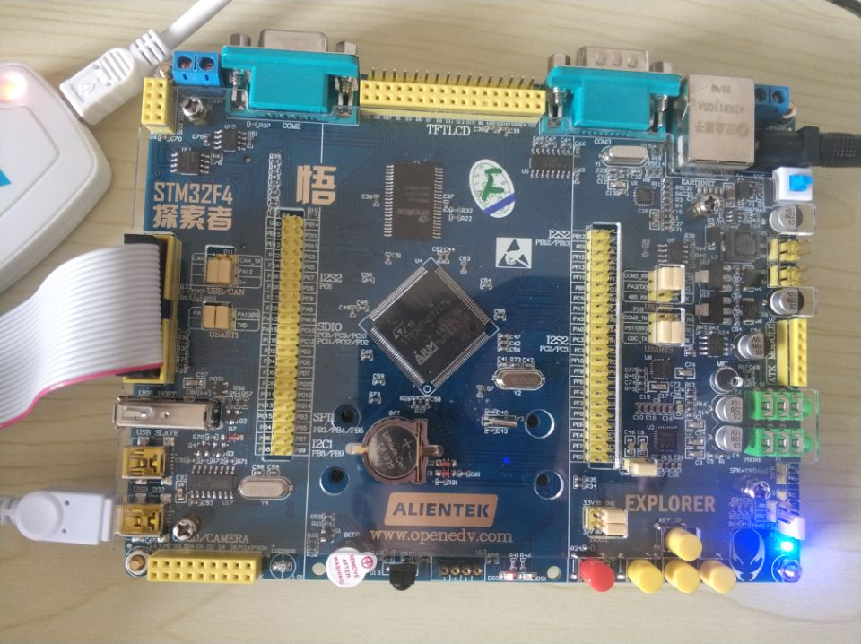
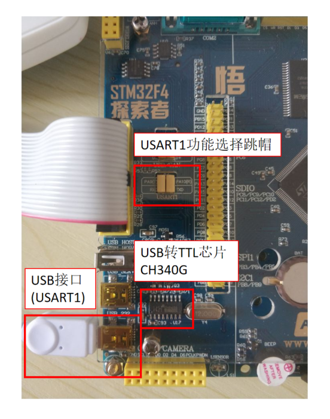
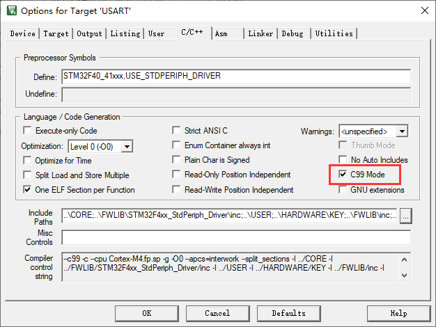
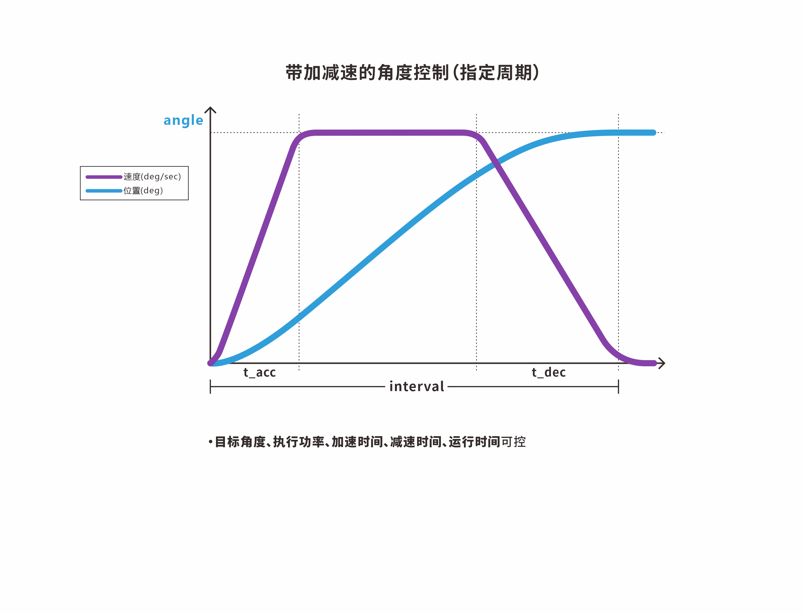
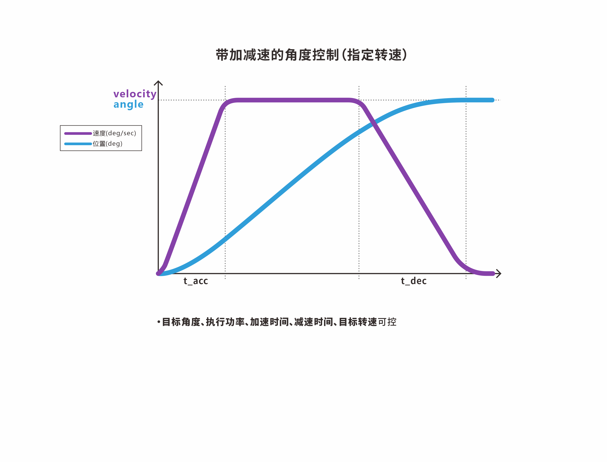
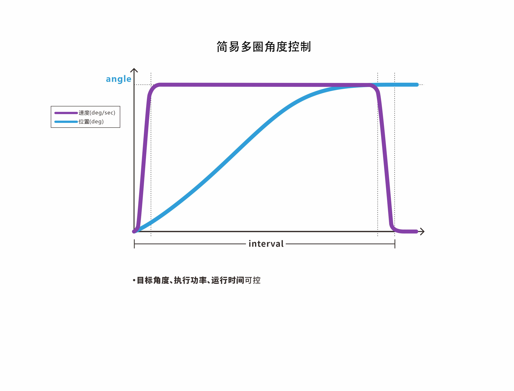
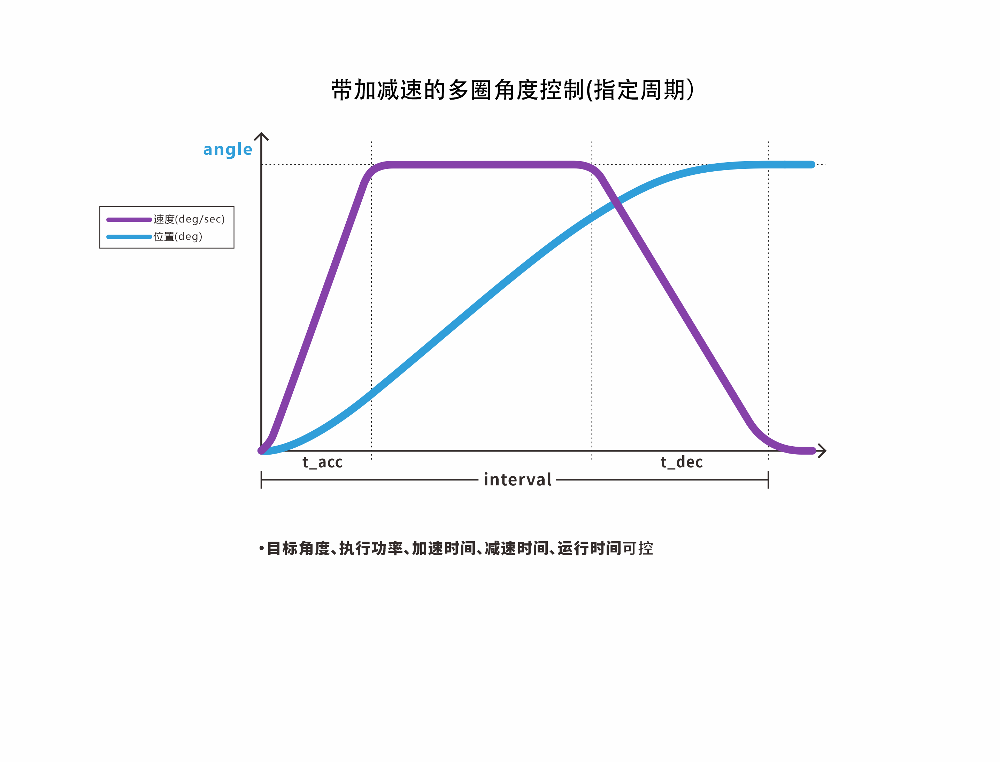

# 总线伺服舵机SDK使用手册（STM32F407）

## 1.概述

本SDK提供了基于[总线伺服舵机通信协议](https://wiki.fashionrobo.com/uartbasic/uart-protocol/)的STM32F407的API函数，适用于所有总线伺服舵机型号。


### 1.1.上位机软件

上位机软件可以调试总线伺服舵机，测试总线伺服舵机的功能。

- 上位机软件：[FashionStar UART总线伺服舵机上位机软件](https://fashionrobo.com/wp-content/uploads/download/Develop-US_1.0.4.171.zip)

- 使用说明：[总线伺服舵机上位机软件使用说明](https://wiki.fashionrobo.com/uartbasic/uart-servo-software/)

### 1.2.SDK

本文例程、API下载。

- STM32F407_SDK下载链接：[SDK for STM32F407](https://fashionrobo.com/downloadcenter/)


### 1.3.开发软件

总线伺服舵机转接板使用的USB转TTL串口芯片是`CH340`，需要在Windows上安装驱动。[检查驱动是否安装成功](https://jingyan.baidu.com/article/00a07f3872a90982d028dcb9.html)

+ keil5：[keil5下载链接](https://fashionrobo.com/wp-content/uploads/download/keil5.zip)
+ STLink驱动：[STLink驱动下载链接](https://fashionrobo.com/wp-content/uploads/download/STLinkV2.zip)
+ 串口调试助手：[XCOM V2.2下载链接](https://www.amobbs.com/forum.php?mod=attachment&aid=NDQxNzc5fDE5NzMzYjQ1fDE1NzY2NTQ4NTN8MHw1NzAzODMz)
+ 串口调试驱动：[CH340驱动下载链接](https://fashionrobo.com/wp-content/uploads/download/CH341SER.zip)


### 1.4.图例

HP8-U45-M总线伺服舵机


总线伺服舵机转接板UC-01


## 2.接线说明


本文使用的开发板

- 开发板型号：正点原子STM32F4探索者开发板；
- IC型号：STM32F407ZGT6。

你也可以选择其他的STM32F4系列的单片机/开发板， 需要自行移植。




### 2.1.STM32与STLinkV2的接线

可以选择其他下载器与开发板进行连接。


### 2.2.STM32与总线伺服舵机的接线

| STM32F4         | 舵机转接板 | 备注                                     |
| --------------- | ---------- | ---------------------------------------- |
| PA2 (USART2 Tx) | RX         |                                          |
| PA3 (USART2 Rx) | TX         |                                          |
| GND             | GND        |                                          |
| 5v              | 5v         | 可选，因为开发板与舵机转接板是独立供电的 |

跳帽选择`COM2_RX`与`COM2_TX` 相连接，将其作为普通的USART使用。


### 2.3.USART1-USB转串口（可选）

正点原子的开发板上自带了一个USB转TLL模块(CH340G)，连接到STM32F407的USART1上。

标注为`USB_232` , 连接到电脑上。



### 2.4.开发板外接电源

* USB供电(USB_232接口) / 电源适配器供电。
* 打开开发板的电源开关


## 3.开发环境配置


### 3.1.Keil-设置编码格式

设置Keil代码编辑器的默认编码为 `Chinese GB2312 (Simplified)`

设置路径: `Eidt`  -> `Configuration` 


### 3.2.Keil-调试器选项

设置调试工具`ST-Link Debugger`。


勾选`Reset and Run`选项，方便测试。


### 3.3.Keil-设置编译标准

正点原子的代码示例，默认C99选项没有被勾选，需要手动勾选。




## 4.通讯检测

检查舵机是否在线，就需要用到通讯检测指令。

- 如果ID号的舵机存在且在线，舵机在接收到通讯检测指令时，会发送一个响应包。

- 如果ID号的舵机不存在或者掉线，就不会有舵机发送响应数据包。


### 4.1.通讯检测

**函数原型**

```C
FSUS_STATUS FSUS_Ping(Usart_DataTypeDef *usart, uint8_t servo_id);
```

- `usart` 舵机控制对应的串口数据对象`Usart_DataTypeDef`
- `servo_id` 舵机的ID


**使用示例**

舵机通讯检测函数`FSUS_Ping`，依次传入串口数据结构体指针`servoUsart`，还有舵机的ID号`servoId`。

```c
statusCode = FSUS_Ping(servoUsart, servoId);
```

`statusCode`是返回的状态码`FSUS_STATUS`，如果是请求成功则返回`0`，如果是其他的数值则意味着舵机通讯检测失败。可以在`fashion_star_uart_servo.h` 文件里面查阅不同的statusCode对应的错误。

```C
// FSUS状态码
#define FSUS_STATUS uint8_t
#define FSUS_STATUS_SUCCESS 0 // 设置/读取成功
#define FSUS_STATUS_FAIL 1 // 设置/读取失败
#define FSUS_STATUS_TIMEOUT 2 // 等待超时 
#define FSUS_STATUS_WRONG_RESPONSE_HEADER 3 // 响应头不对
#define FSUS_STATUS_UNKOWN_CMD_ID 4 // 未知的控制指令
#define FSUS_STATUS_SIZE_TOO_BIG 5 // 参数的size大于FSUS_PACK_RESPONSE_MAX_SIZE里面的限制
#define FSUS_STATUS_CHECKSUM_ERROR 6 // 校验和错误
#define FSUS_STATUS_ID_NOT_MATCH 7 // 请求的舵机ID跟反馈回来的舵机ID不匹配
```

### 4.2.例程-检测舵机是否在线

**功能简介**

持续向0号舵机发送通信检测指令，并且根据0号舵机的响应情况亮起不同颜色的灯，同时在日志输出串口打印提示信息。

**源代码**

```c
void FSUSExample_PingServo(void)
{

	FSUS_STATUS status_code; // 状态码
	uint8_t servo_id = 0;	 // 舵机ID = 0

	printf("===Test Uart Servo Ping===r\n");
	while (1)
	{
		// 舵机通信检测
		status_code = FSUS_Ping(servo_usart, servo_id);
		if (status_code == FSUS_STATUS_SUCCESS)
		{
			// 舵机在线， LED1闪烁(绿灯)
			printf("Servo Online \r\n");
			LED0 = LED_OFF;
			LED1 = !LED1;
		}
		else
		{
			// 舵机离线， LED0闪烁(红灯)
			printf("Servo Offline,Error Code=%d \r\n", status_code);
			LED0 = !LED0;
			LED1 = LED_OFF;
		}
		// 延时等待1s
		SysTick_DelayMs(1000);
	}
}
```


## 5.单圈角度控制

</td></tr></table><table><tr><td bgcolor=#DDDDDD>

**注意事项：**

- 舵机只会响应最新的角度控制指令。当需要连续执行多个角度控制命令时，可以在程序中使用延时或者读取角度来判断上一个命令是否完成。
- 建议连续发送指令给同一个舵机时，指令间隔在10ms以上。
- 若power = 0或者大于功率保持值，按照功率保持值执行。功率保持值可在上位机进行设置。
- 舵机的最大旋转速度因舵机型号、负载情况而异。

</td></tr></table>


### 5.1.简易角度控制


**函数原型**

```c
FSUS_STATUS FSUS_SetServoAngle(Usart_DataTypeDef *usart, uint8_t servo_id, float angle, uint16_t interval, uint16_t power, uint8_t wait);
```

* `usart` 舵机控制对应的串口数据对象`Usart_DataTypeDef`
* `servo_id` 舵机的ID
* `angle` 舵机的目标角度，最小单位 0.1°，取值范围 [-180.0, 180.0] 
* `interval` 舵机的运行时间，单位ms，最小值 > 100
* `power` 舵机执行功率，单位mV，默认为0
* `wait` API是否为阻塞式；`0`：不阻塞，`1`：等待舵机旋转到特定的位置

**使用示例**

```c
// 舵机控制相关的参数

uint8_t servoId = 0;  // 舵机的ID号
float angle = 0;// 舵机的目标角度  舵机角度在-180度到180度之间, 最小单位0.1°
uint16_t interval = 2000; // 运行时间ms  可以尝试修改设置更小的运行时间，例如500ms
uint16_t power = 0; // 舵机执行功率 单位mV 默认为0   
uint8_t wait = 0; //  API是否为阻塞式，0:不等待 1:等待舵机旋转到特定的位置; 

FSUS_SetServoAngle(servoUsart, servoId, angle, interval, power, wait);
```


### 5.2.带加减速的角度控制(指定周期)



**函数原型**

```c
FSUS_STATUS FSUS_SetServoAngleByInterval(Usart_DataTypeDef *usart, uint8_t servo_id, \
                float angle, uint16_t interval, uint16_t t_acc, \
                uint16_t t_dec, uint16_t  power, uint8_t wait);
```


* `usart` 舵机控制对应的串口数据对象`Usart_DataTypeDef`

* `servo_id` 舵机的ID

* `angle` 舵机的目标角度，最小单位 0.1°，取值范围 [-180.0, 180.0] 

* `interval` 舵机的运行时间，单位ms，取值须 > `t_acc` + `t_dec`，最小值 > 100

* `t_acc` 舵机启动到匀速的时间，单位ms，最小值 > 20

* `t_dec` 舵机接近目标角度时的减速时间，单位ms，最小值 > 20

* `power` 舵机执行功率，单位mV，默认为0

* `wait` API是否为阻塞式；`0`：不阻塞，`1`：等待舵机旋转到特定的位置

  

**使用示例**

```c
//// 舵机控制相关的参数
// 舵机的ID号
uint8_t servoId = 0;  
// 舵机的目标角度
// 舵机角度在-180度到180度之间, 最小单位0.1°
float angle = 0; 
// 运行时间ms  
// 可以尝试修改设置更小的运行时间，例如500ms
uint16_t interval = 2000; 
// 加速时间
uint16_t t_acc = 100;
// 减速时间
uint16_t t_dec = 150;
// 舵机执行功率 单位mV 默认为0   
uint16_t power = 0;
 //  API是否为阻塞式，0:不等待 1:等待舵机旋转到特定的位置; 
uint8_t wait = 0; 

FSUS_SetServoAngleByInterval(servo_usart, servo_id, angle, interval, t_acc, t_dec, power, wait);
```


### 5.3.带加减速的角度控制(指定转速)



**函数原型**

```c
FSUS_STATUS FSUS_SetServoAngleByVelocity(Usart_DataTypeDef *usart, uint8_t servo_id, \
                float angle, float velocity, uint16_t t_acc, \
                uint16_t t_dec, uint16_t  power, uint8_t wait);
```

* `usart` 舵机控制对应的串口数据对象`Usart_DataTypeDef`
* `servo_id` 舵机的ID
* `angle` 舵机的目标角度，最小单位 0.1°，取值范围 [-180.0, 180.0] 
* `velocity` 舵机目标转速，单位°/s，取值范围 [1 ,750] 
* `t_acc` 舵机启动到匀速的时间，单位ms，最小值 > 20
* `t_dec` 舵机接近目标角度时的减速时间，单位ms，最小值 > 20
* `power` 舵机执行功率，单位mV，默认为0
* `wait` API是否为阻塞式；`0`：不阻塞，`1`：等待舵机旋转到特定的位置


**使用示例**

```c
//// 舵机控制相关的参数
// 舵机的ID号
uint8_t servoId = 0;  
// 舵机的目标角度
// 舵机角度在-180度到180度之间, 最小单位0.1°
float angle = 0; 
// 目标转速
float velocity;
// 加速时间
uint16_t t_acc = 100;
// 减速时间
uint16_t t_dec = 150;
// 舵机执行功率 单位mV 默认为0   
uint16_t power = 0;
 //  API是否为阻塞式，0:不等待 1:等待舵机旋转到特定的位置; 
uint8_t wait = 0; 

FSUS_SetServoAngleByVelocity(servo_usart, servo_id, angle, velocity, t_acc, t_dec, power, wait);
```


### 5.4.当前角度查询

**函数原型**

```c
// 查询单个舵机的角度信息 angle 单位度
FSUS_STATUS FSUS_QueryServoAngle(Usart_DataTypeDef *usart, uint8_t servo_id, float *angle);
```

* `usart` 舵机控制对应的串口数据对象`Usart_DataTypeDef`
* `servo_id` 舵机的ID
* `angle` 舵机当前的角度存放指针


**使用示例**

```c
uint8_t servoId = 0;    // 舵机的ID号
float curAngle = 0;     // 舵机当前所在的角度
FSUS_QueryServoAngle(servoUsart, servoId, &curAngle); // 读取一下舵机的角度
//curAngle = 当前单圈角度
```

### 5.5.例程-控制单个舵机


**功能简介**

测试控制舵机的角度，演示了三种控制舵机角度的API，在每次执行完角度控制命令后，会调用当前角度查询API得到实时角度。

- 简易角度控制 + 当前角度查询
- 带加减速的角度控制(指定周期) + 当前角度查询
- 带加减速的角度控制(指定转速) + 当前角度查询


**源代码**

```c
/* 控制单个舵机的角度 */
void FSUSExample_SetServoAngle(void)
{
	// 舵机控制相关的参数
	// 舵机的ID号
	uint8_t servo_id = 0;
	// 舵机的目标角度
	// 舵机角度在-180度到180度之间, 最小单位0.1
	float angle = 0;
	// 时间间隔ms
	// 可以尝试修改设置更小的时间间隔，例如500ms
	uint16_t interval;
	// 目标转速
	float velocity;
	// 加速时间
	uint16_t t_acc;
	// 减速时间
	uint16_t t_dec;
	// 舵机执行功率 mV 默认为0
	uint16_t power = 0;
	// 设置舵机角度的时候, 是否为阻塞式
	// 0:不等待 1:等待舵机旋转到特定的位置;
	uint8_t wait = 1;
	// 读取的角度
	float angle_read;

	while (1)
	{
		printf("GOTO: 90.0f\r\n");
		// 控制舵机角度
		angle = 90.0;
		interval = 2000;
		FSUS_SetServoAngle(servo_usart, servo_id, angle, interval, power, wait);
		FSUS_QueryServoAngle(servo_usart, servo_id, &angle_read);
		printf("Cur Angle: %.1f\r\n", angle_read);

		// 等待2s
		SysTick_DelayMs(2000);

		// 控制舵机角度 + 指定时间
		printf("GOTO+Interval: 0.0f\r\n");
		angle = 0.0f;
		interval = 1000;
		t_acc = 100;
		t_dec = 150;
		FSUS_SetServoAngleByInterval(servo_usart, servo_id, angle, interval, t_acc, t_dec, power, wait);
		FSUS_QueryServoAngle(servo_usart, servo_id, &angle_read);
		printf("Cur Angle: %.1f\r\n", angle_read);

		// 等待2s
		SysTick_DelayMs(2000);

		// 控制舵机角度 + 指定转速
		printf("GOTO+Velocity: -9.0f\r\n");
		angle = -90.0f;
		velocity = 200.0f;
		t_acc = 100;
		t_dec = 150;
		FSUS_SetServoAngleByVelocity(servo_usart, servo_id, angle, velocity, t_acc, t_dec, power, wait);
		FSUS_QueryServoAngle(servo_usart, servo_id, &angle_read);
		printf("Cur Angle: %.1f\r\n", angle_read);
	}
}
```


**输出日志**

```C
GOTO: 90.0f
Cur Angle: 89.7
GOTO+Interval: 0.0f
Cur Angle: 0.4
GOTO+Velocity: -9.0f
Cur Angle: -89.5
```


### 5.6.例程-检测舵机是否在线控制多个舵机


**功能简介**

演示如何使用简易角度控制指令来控制多个舵机。


**源代码**

```c
void FSUSExample_SetNServoAngle(void)
{
	//// 舵机控制相关的参数
	// 时间间隔ms
	// 可以尝试修改设置更小的时间间隔，例如500ms
	uint16_t interval = 2000;
	// 舵机执行功率 mV 默认为0
	uint16_t power = 0;
	// 设置舵机角度的时候, 是否为阻塞式
	// 0:不等待 1:等待舵机旋转到特定的位置;
	uint8_t wait = 0;
	// 是否为多圈模式
	// 0: 单圈模式; 1: 多圈模式;
	uint8_t is_mturn = 0;
	while (1)
	{
		// 控制舵机云台角度
		FSUS_SetServoAngle(servo_usart, 0, 90.0, interval, power, wait);
		FSUS_SetServoAngle(servo_usart, 1, 45.0, interval, power, wait);
		// 阻塞式等待, 等待旋转到目标角度
		// 注意要跟设定值相同
		FSUS_Wait(servo_usart, 0, 90.0, is_mturn);
		FSUS_Wait(servo_usart, 1, 45.0, is_mturn);

		// 等待2s
		SysTick_DelayMs(2000);

		// 控制舵机旋转到另外一个角度
		FSUS_SetServoAngle(servo_usart, 0, -90.0, interval, power, wait);
		FSUS_SetServoAngle(servo_usart, 1, -45.0, interval, power, wait);
		// 阻塞式等待, 等待旋转到目标角度
		// 注意要跟设定值相同
		FSUS_Wait(servo_usart, 0, -90.0, is_mturn);
		FSUS_Wait(servo_usart, 1, -45.0, is_mturn);

		// 等待2s
		SysTick_DelayMs(2000);
	}
}
```


## 6.多圈角度控制

</td></tr></table><table><tr><td bgcolor=#DDDDDD>

**注意事项：**

- 舵机只会响应最新的角度控制指令。当需要连续执行多个角度控制命令时，可以在程序中使用延时或者读取角度来判断上一个命令是否完成。
- 建议连续发送指令给同一个舵机时，指令间隔在10ms以上。
- 若power = 0或者大于功率保持值，按照功率保持值执行。功率保持值可在上位机进行设置。
- 舵机的最大旋转速度因舵机型号、负载情况而异。

</td></tr></table>


### 6.1.简易多圈角度控制



**函数原型**

```c
FSUS_STATUS FSUS_SetServoAngleMTurn(Usart_DataTypeDef *usart, uint8_t servo_id, float angle, \
			uint32_t interval, uint16_t power, uint8_t wait);
```

* `usart` 舵机控制对应的串口数据对象`Usart_DataTypeDef`
* `servo_id` 舵机的ID
* `angle` 舵机的目标角度，最小单位 0.1°，取值范围 [-368,640.0° ,  368,640.0°]
* `interval` 舵机的运行时间，单位ms，最小值 > 100
* `power` 舵机执行功率，单位mV，默认为0
* `wait` API是否为阻塞式；`0`：不阻塞，`1`：等待舵机旋转到特定的位置


**使用示例**

```C
//// 舵机控制相关的参数
// 舵机的ID号
uint8_t servo_id = 0;  
// 舵机的目标角度
float angle= 720.0f; 
uint32_t interval = 2000; 	// 运行时间ms  
// 舵机执行功率，单位mV，默认为0	
uint16_t power = 0;
 //  API是否为阻塞式，0:不等待 1:等待舵机旋转到特定的位置; 
uint8_t wait = 0; 

FSUS_SetServoAngleMTurn(servo_usart, servo_id, angle, interval, power, wait);
```


### 6.2.带加减速的多圈角度控制(指定周期)



**函数原型**

```c
FSUS_STATUS FSUS_SetServoAngleMTurnByInterval(Usart_DataTypeDef *usart, uint8_t servo_id, float angle, \
			uint32_t interval,  uint16_t t_acc,  uint16_t t_dec, uint16_t power, uint8_t wait);
```

* `usart` 舵机控制对应的串口数据对象`Usart_DataTypeDef`
* `servo_id` 舵机的ID
* `angle` 舵机的目标角度，最小单位 0.1°，取值范围 [-368,640.0° ,  368,640.0°]
* `interval` 舵机的运行时间，单位ms，取值须 > `t_acc` + `t_dec`，最小值 > 100
* `t_acc` 舵机启动到匀速的时间，单位ms，最小值 > 20
* `t_dec` 舵机接近目标角度时的减速时间，单位ms，最小值 > 20
* `power` 舵机执行功率，单位mV，默认为0
* `wait` API是否为阻塞式；`0`：不阻塞，`1`：等待舵机旋转到特定的位置

**使用示例**

```c
//// 舵机控制相关的参数
// 舵机的ID号
uint8_t servo_id = 0;  
// 舵机的目标角度
float angle= 720.0f; 
uint32_t interval = 2000; 	// 运行时间ms  
// 舵机执行功率，单位mV，默认为0	
uint16_t power = 0;
 //  API是否为阻塞式，0:不等待 1:等待舵机旋转到特定的位置; 
uint8_t wait = 1; 
// 加速时间(单位ms)
uint16_t t_acc = 100;
// 减速时间
uint16_t t_dec = 200;

FSUS_SetServoAngleMTurnByInterval(servo_usart, servo_id, angle, interval, t_acc, t_dec, power, wait);
```


### 6.3.带加减速的多圈角度控制(指定转速)


**函数原型**

```c
FSUS_STATUS FSUS_SetServoAngleMTurnByVelocity(Usart_DataTypeDef *usart, uint8_t servo_id, float angle, \
			float velocity, uint16_t t_acc,  uint16_t t_dec, uint16_t power, uint8_t wait);
```

* `usart` 舵机控制对应的串口数据对象`Usart_DataTypeDef`
* `servo_id` 舵机的ID
* `angle` 舵机的目标角度，最小单位 0.1°，取值范围 [-368,640.0° ,  368,640.0°]
* `velocity` 舵机目标转速，单位°/s，取值范围 [1 ,750] 
* `t_acc` 舵机启动到匀速的时间，单位ms，最小值 > 20
* `t_dec` 舵机接近目标角度时的减速时间，单位ms，最小值 > 20
* `power` 舵机执行功率，单位mV，默认为0
* `wait` API是否为阻塞式；`0`：不阻塞，`1`：等待舵机旋转到特定的位置

**使用示例**

```c
//// 舵机控制相关的参数
// 舵机的ID号
uint8_t servo_id = 0;  
// 舵机的目标角度
float angle= 720.0f; 
float velocity = 100.0f;	// 电机转速, 单位dps,°/s 
// 舵机执行功率，单位mV，默认为0	
uint16_t power = 0;
 //  API是否为阻塞式，0:不等待 1:等待舵机旋转到特定的位置; 
uint8_t wait = 1; 
// 加速时间(单位ms)
uint16_t t_acc = 100;
// 减速时间
uint16_t t_dec = 200;

FSUS_SetServoAngleMTurnByVelocity(servo_usart, servo_id, angle, velocity, t_acc, t_dec, power, wait);
```


### 6.4.当前多圈角度查询


**函数原型**

```c
FSUS_STATUS FSUS_QueryServoAngleMTurn(Usart_DataTypeDef *usart, uint8_t servo_id, float *angle);
```

* `usart` 舵机控制对应的串口数据对象`Usart_DataTypeDef`

* `servo_id` 舵机的ID

* `angle` 舵机当前的多圈角度存放指针

**使用示例**

```C
uint8_t servoId = 0;    // 舵机的ID号
float curAngle = 0;     // 舵机当前所在的角度
FSUS_QueryServoAngleMTurn(servoUsart, servoId, &curAngle); // 读取一下舵机的角度
//curAngle = 当前单圈角度
```

### 6.5.清除多圈圈数

**函数原型**

```C
FSUS_STATUS FSUS_ServoAngleReset(Usart_DataTypeDef *usart, uint8_t servo_id);
```

* `usart` 舵机控制对应的串口数据对象`Usart_DataTypeDef`

* `servo_id` 舵机的ID

**使用示例**

```C
uint8_t servoId = 0;    // 舵机的ID号
FSUS_ServoAngleReset(servoUsart, servoId); // 清除多圈圈数
```


### 6.6.例程-多圈角度控制


**功能简介**

例程演示了多圈角度控制以及查询实时多圈角度的API使用方法

- 简易多圈角度控制+ 当前多圈角度查询
- 带加减速的多圈角度控制(指定周期)+ 当前多圈角度查询
- 带加减速的多圈角度控制(指定转速)+ 当前多圈角度查询


**源代码**

```c
/* 多圈角度控制 */
void FSUSExample_SetServoAngleMTurn(void)
{
    //// 舵机控制相关的参数
    // 舵机的ID号
    uint8_t servo_id = 0;
    // 舵机的目标角度
    // 舵机角度在-180度到180度之间, 最小单位0.1
    float angle;
    uint32_t interval; // 时间间隔ms
    float velocity;    // 电机转速, 单位dps,°/s
    // 舵机执行功率 mV 默认为0
    uint16_t power = 0;
    // 设置舵机角度的时候, 是否为阻塞式
    // 0:不等待 1:等待舵机旋转到特定的位置;
    uint8_t wait = 1;
    // 加速时间(单位ms)
    uint16_t t_acc;
    // 减速时间
    uint16_t t_dec;
    // 读取的角度
    float angle_read;

    while (1)
    {
        printf("MTurn GOTO: 720.0f\r\n");
        // 控制舵机角度(多圈)
        angle = 720.0f;
        interval = 2000;
        FSUS_SetServoAngleMTurn(servo_usart, servo_id, angle, interval, power, wait);
        FSUS_QueryServoAngleMTurn(servo_usart, servo_id, &angle_read);
        printf("Cur Angle: %.1f\r\n", angle_read);

        // 等待2s
        SysTick_DelayMs(2000);

        // 控制舵机旋转到另外一个角度(多圈)
        printf("MTurn GOTO: 0.0f\r\n");
        angle = 0.0;
        FSUS_SetServoAngleMTurn(servo_usart, servo_id, angle, interval, power, wait);
        FSUS_QueryServoAngleMTurn(servo_usart, servo_id, &angle_read);
        printf("Cur Angle: %.1f\r\n", angle_read);

        // 等待2s
        SysTick_DelayMs(2000);

        // 控制舵机角度(多圈+指定周期)
        printf("MTurn+Interval GOTO: -180.0f\r\n");
        angle = 180.0f;
        interval = 1000;
        t_acc = 100;
        t_dec = 200;
        FSUS_SetServoAngleMTurnByInterval(servo_usart, servo_id, angle, interval, t_acc, t_dec, power, wait);
        FSUS_QueryServoAngleMTurn(servo_usart, servo_id, &angle_read);
        printf("Cur Angle: %.1f\r\n", angle_read);

        // 等待2s
        SysTick_DelayMs(2000);

        // 控制舵机角度(多圈+指定转速)
        printf("MTurn+Velocity GOTO: -180.0f\r\n");
        angle = -180.0f;
        velocity = 100.0f;
        t_acc = 100;
        t_dec = 200;
        FSUS_SetServoAngleMTurnByVelocity(servo_usart, servo_id, angle, velocity, t_acc, t_dec, power, wait);
        FSUS_QueryServoAngleMTurn(servo_usart, servo_id, &angle_read);
        printf("Cur Angle: %.1f\r\n", angle_read);

        // 等待2s
        SysTick_DelayMs(2000);
    }
}

```


**输出日志**

```
MTurn GOTO: 720.0f
Cur Angle: 719.7
MTurn GOTO: 0.0f
Cur Angle: 0.4
MTurn+Interval GOTO: -180.0f
Cur Angle: 179.7
MTurn+Velocity GOTO: -180.0f
Cur Angle: -179.5
MTurn GOTO: 720.0f
Cur Angle: 719.5
MTurn GOTO: 0.0f
Cur Angle: 0.4
MTurn+Interval GOTO: -180.0f
Cur Angle: 179.7
MTurn+Velocity GOTO: -180.0f
Cur Angle: -179.5
```


## 7.舵机阻尼模式


### 7.1.设置阻尼模式并设置功率

**函数原型**

```c
// 舵机阻尼模式
FSUS_STATUS FSUS_DampingMode(Usart_DataTypeDef *usart, uint8_t servoId, uint16_t power);
```

* `usart` 舵机控制对应的串口数据对象`Usart_DataTypeDef`
* `servoId` 舵机的ID
* `power` 舵机的功率  单位mW

**使用示例**

```c
// 连接在转接板上的总线伺服舵机ID号
uint8_t servoId = 0; 
// 阻尼模式下的功率，功率越大阻力越大
uint16_t power = 500;
// 设置舵机为阻尼模式
FSUS_DampingMode(servoUsart, servoId, power);
```

### 7.2.例程-阻尼模式与角度回传


**功能简介**

设置舵机为阻尼模式，同时请求舵机的角度。在旋转舵机的情况下，每隔一段时间就更新一下舵机的角度。串口每隔一段时间打印一下舵机角度信息。


**源代码**

```c
/* 舵机阻尼模式与角度回传 */
void FSUSExample_SetServoDamping(void)
{
	FSUS_STATUS status_code; // 请求包的状态码
	uint8_t servo_id = 0;	 // 连接在转接板上的总线伺服舵机ID号
	uint16_t power = 500;	 // 阻尼模式下的功率，功率越大阻力越大
	float angle = 0;		 // 舵机的角度

	// 设置舵机为阻尼模式
	FSUS_DampingMode(servo_usart, servo_id, power);
	while (1)
	{
		// 读取一下舵机的角度
		status_code = FSUS_QueryServoAngle(servo_usart, servo_id, &angle);

		if (status_code == FSUS_STATUS_SUCCESS)
		{
			// 成功的读取到了舵机的角度
			printf("[INFO] servo id= %d ; angle = %f\r\n", servo_id, angle);
		}
		else
		{
			// 没有正确的读取到舵机的角度
			printf("\r\n[INFO] read servo %d angle, status code: %d \r\n", servo_id, status_code);
			printf("[ERROR]failed to read servo angle\r\n");
		}
		// 等待500ms
		SysTick_DelayMs(500);
	}
}
```

**日志输出**

```C
[INFO] servo id= 0 ; angle = 0.000000
[INFO] servo id= 0 ; angle = 0.100000
[INFO] servo id= 0 ; angle = 0.100000
[INFO] servo id= 0 ; angle = 12.000000
[INFO] servo id= 0 ; angle = 42.799999
[INFO] servo id= 0 ; angle = 51.700001
[INFO] servo id= 0 ; angle = 76.099998
[INFO] servo id= 0 ; angle = 107.099998
[INFO] servo id= 0 ; angle = 133.300003
[INFO] servo id= 0 ; angle = 163.100006
```


## 8.舵机轮式模式


### 8.1.定速持续旋转

**函数原型**

```c
// 轮式模式 不停的旋转
FSUS_STATUS FSUS_WheelKeepMove(Usart_DataTypeDef *usart, uint8_t servoId, uint8_t is_cw, uint16_t speed);
```

* `usart` 舵机控制对应的串口数据对象`Usart_DataTypeDef`
* `servoId` 舵机的ID
* `is_cw` 是否顺时针旋转；`0`：否，逆时针旋转，`1`：是，顺时针旋转
* `speed` 舵机旋转速度，单位 °/s

**使用示例**

```c
uint8_t servoId = 0; 	// 连接在转接板上的总线伺服舵机ID号
uint16_t speed = 20; 	// 舵机的旋转速度 20°/s
uint8_t is_cw = 0; 		// 舵机的旋转方向
FSUS_WheelKeepMove(servoUsart, servoId, is_cw, speed);
```


### 8.2.旋转特定的时间

**函数原型**

```c
// 轮式模式 按照特定的速度旋转特定的时间
FSUS_STATUS FSUS_WheelMoveTime(Usart_DataTypeDef *usart, uint8_t servoId, uint8_t is_cw, uint16_t speed, uint16_t nTime);
```

* `usart` 舵机控制对应的串口数据对象`Usart_DataTypeDef`
* `servoId` 舵机的ID
* `is_cw` 是否顺时针旋转；`0`：否，逆时针旋转，`1`：是，顺时针旋转
* `speed` 舵机旋转速度，单位 °/s
* `nTime` 舵机持续旋转的时间，单位ms。

**使用示例**

```c
uint8_t servoId = 0; 	// 连接在转接板上的总线伺服舵机ID号
uint16_t speed = 20; 	// 舵机的旋转速度 20°/s
uint8_t is_cw = 0; 		// 舵机的旋转方向
uint16_t nTime = 3000; 	// 延时时间
FSUS_WheelMoveTime(servoUsart, servoId, is_cw, speed, nTime);
```


### 8.3.旋转特定的圈数

**函数原型**

```c
// 轮式模式 旋转特定的圈数
FSUS_STATUS FSUS_WheelMoveNCircle(Usart_DataTypeDef *usart, uint8_t servoId, uint8_t is_cw, uint16_t speed, uint16_t nCircle);
```

* `usart` 舵机控制对应的串口数据对象`Usart_DataTypeDef`
* `servoId` 舵机的ID
* `is_cw` 是否顺时针旋转；`0`：否，逆时针旋转，`1`：是，顺时针旋转
* `speed` 舵机旋转的速度，单位 °/s
* `nCircle` 舵机持续旋转的圈数  单位：圈

**使用示例**

```c
uint8_t servoId = 0; 	// 连接在转接板上的总线伺服舵机ID号
uint16_t speed = 200; 	// 舵机的旋转速度 单位°/s
uint8_t is_cw = 0; 		// 舵机的旋转方向
uint16_t nCircle = 1; 	// 舵机旋转的圈数
FSUS_WheelMoveNCircle(servoUsart, servoId, is_cw, speed, nCircle);
```


### 8.4.例程-舵机持续旋转


**功能简介**

测试舵机360度定速持续旋转


**源代码**

```c
void FSUSExample_WheelKeepMove(void)
{
	uint8_t servo_id = 0; // 连接在转接板上的总线伺服舵机ID号
	uint16_t speed = 20;  // 舵机的旋转速度 °/s
	uint8_t is_cw = 0;	  // 舵机的旋转方向

	while (1)
	{
		// 舵机轮式模式定速控制 顺时针旋转3s
		is_cw = 1;
		FSUS_WheelKeepMove(servo_usart, servo_id, is_cw, speed);
		SysTick_DelayMs(3000);

		// 舵机刹车 停顿1s
		FSUS_WheelStop(servo_usart, servo_id);
		SysTick_DelayMs(1000);

		// 舵机轮式模式定速控制 逆时针旋转3s
		is_cw = 0;
		FSUS_WheelKeepMove(servo_usart, servo_id, is_cw, speed);
		SysTick_DelayMs(3000);

		// 舵机刹车 停顿1s
		FSUS_WheelStop(servo_usart, servo_id);
		SysTick_DelayMs(1000);
	}
}

```


### 8.5.例程-舵机定时旋转


**功能简介**

测试舵机定时旋转，顺时针旋转3s，然后逆时针旋转3s。


**源代码**

```c
void FSUSExample_WheelMoveNTime(void)
{
	uint8_t servo_id = 0;	// 连接在转接板上的总线伺服舵机ID号
	uint16_t speed = 20;	// 舵机的旋转速度 °/s
	uint8_t is_cw = 0;		// 舵机的旋转方向
	uint16_t n_time = 3000; // 延时时间

	while (1)
	{
		// 舵机轮式模式定速控制 顺时针旋转3s
		is_cw = 1;
		FSUS_WheelMoveTime(servo_usart, servo_id, is_cw, speed, n_time);
		// FSUS_WheelMoveTime是非阻塞的,因为有时候需要控制多个舵机同时旋转
		// 所以在后面要手动加延迟
		SysTick_DelayMs(n_time);

		// 停顿1s
		SysTick_DelayMs(1000);

		// 舵机轮式模式定速控制 逆时针旋转3s
		is_cw = 0;
		FSUS_WheelMoveTime(servo_usart, servo_id, is_cw, speed, n_time);
		SysTick_DelayMs(n_time);

		// 停顿1s
		SysTick_DelayMs(1000);
	}
}

```


### 8.6.例程-舵机定圈旋转


**功能简介**

测试舵机定圈旋转，顺时针旋转一圈，然后逆时针旋转一圈。


**源代码**

```c
void FSUSExample_WheelMoveNCircle(void)
{
	uint8_t servo_id = 0;  // 连接在转接板上的总线伺服舵机ID号
	uint16_t speed = 200;  // 舵机的旋转速度 °/s
	uint8_t is_cw = 0;	   // 舵机的旋转方向
	uint16_t n_circle = 1; // 舵机旋转的圈数

	while (1)
	{
		// 舵机轮式模式定速控制 顺时针旋转1圈
		is_cw = 1;
		FSUS_WheelMoveNCircle(servo_usart, servo_id, is_cw, speed, n_circle);
		// FSUS_WheelMoveNCircle是非阻塞的,因为有时候需要控制多个舵机同时旋转
		// 延时估算所需时间
		SysTick_DelayMs(FSUSExample_EstimateTimeMs(n_circle, speed));

		// 停顿1s
		SysTick_DelayMs(1000);

		// 舵机轮式模式定速控制 逆时针旋转1圈
		is_cw = 0;
		FSUS_WheelMoveNCircle(servo_usart, servo_id, is_cw, speed, n_circle);
		// 注意: FSUS_WheelMoveNCircle是非阻塞的,因为有时候需要控制多个舵机同时旋转
		// 延时估算所需时间
		SysTick_DelayMs(FSUSExample_EstimateTimeMs(n_circle, speed));

		// 停顿1s
		SysTick_DelayMs(1000);
	}
}
```


## 9.**舵机状态读取**


### 9.1.读取参数

**函数原型**

```c
// 读取数据
FSUS_STATUS FSUS_ReadData(Usart_DataTypeDef *usart, uint8_t servoId,  uint8_t address, uint8_t *value, uint8_t *size);
```

* `usart` 舵机控制对应的串口数据对象`Usart_DataTypeDef`
* `servoId` 舵机的ID
* `address` 只读参数或自定义参数地址
* `value` 读取到的数据存放指针
* `size` 读取到的数据的长度存放指针

**使用示例**

```c
uint8_t servoId = 0;  		// 连接在转接板上的总线伺服舵机ID号
uint8_t value;
uint8_t dataSize;

statusCode = FSUS_ReadData(servoUsart, servoId, FSUS_PARAM_SERVO_STATUS, (uint8_t *)&value, &dataSize);

if (statusCode == FSUS_STATUS_SUCCESS)
{
    // 舵机工作状态标志位
    // BIT[0] - 执行指令置1，执行完成后清零。
    // BIT[1] - 执行指令错误置1，在下次正确执行后清零。
    // BIT[2] - 堵转错误置1，解除堵转后清零。
    // BIT[3] - 电压过高置1，电压恢复正常后清零。
    // BIT[4] - 电压过低置1，电压恢复正常后清零。
    // BIT[5] - 电流错误置1，电流恢复正常后清零。
    // BIT[6] - 功率错误置1，功率恢复正常后清零。
    // BIT[7] - 温度错误置1，温度恢复正常后清零。

    if ((value >> 3) & 0x01)
        printf("read sucess, voltage too high\r\n");
    if ((value >> 4) & 0x01)
        printf("read sucess, voltage too low\r\n");
}
```


### 9.2.写入自定义参数

</td></tr></table><table><tr><td bgcolor=#DDDDDD>

推荐使用上位机写入自定义参数。

</td></tr></table>

**函数原型**

```c
// 写入数据
FSUS_STATUS FSUS_WriteData(Usart_DataTypeDef *usart, uint8_t servoId, uint8_t address, uint8_t *value, uint8_t size);
```

* `usart` 舵机控制对应的串口数据对象`Usart_DataTypeDef`
* `servoId` 舵机的ID
* `address`   自定义参数地址
* `value` 写入的数据存放指针
* `size` 写入的数据的长度

**使用示例**

```c
uint8_t servoId = 0;  		// 连接在转接板上的总线伺服舵机ID号
float angleLimitLow = -90.0; 	// 舵机角度下限设定值
value = (int16_t)(angleLimitLow*10); // 舵机角度下限 转换单位为0.1度
statusCode = FSUS_WriteData(servoUsart, servoId, FSUS_PARAM_ANGLE_LIMIT_LOW, (uint8_t *)&value, 2);
```

### 9.3.重置舵机自定义参数

**函数原型**

```c
FSUS_STATUS FSUS_ResetUserData(Usart_DataTypeDef *usart, uint8_t servoId);
```

* `usart` 舵机控制对应的串口数据对象`Usart_DataTypeDef`
* `servoId` 舵机的ID

**使用示例**

```c
uint8_t servoId = 0;  		// 连接在转接板上的总线伺服舵机ID号
FSUS_ResetUserData(servoUsart, servoId);
```


### 9.4.例程-读取舵机参数（温度、功率、工作状态）

**功能简介**

读取舵机的实时状态，并且给出了判断工作状态异常的示例

- 电压
- 电流
- 功率
- 温度
- 工作状态标志位

```C
	// 舵机工作状态标志位
	// BIT[0] - 执行指令置1，执行完成后清零。
	// BIT[1] - 执行指令错误置1，在下次正确执行后清零。
	// BIT[2] - 堵转错误置1，解除堵转后清零。
	// BIT[3] - 电压过高置1，电压恢复正常后清零。
	// BIT[4] - 电压过低置1，电压恢复正常后清零。
	// BIT[5] - 电流错误置1，电流恢复正常后清零。
	// BIT[6] - 功率错误置1，功率恢复正常后清零。
	// BIT[7] - 温度错误置1，温度恢复正常后清零。
```

**源代码**

```c
/*读取舵机状态*/
void FSUSExample_ReadData(void)
{
	uint8_t servo_id = 0;	// 连接在转接板上的总线伺服舵机ID号
	FSUS_STATUS statusCode; // 状态码

	// 数据表里面的数据字节长度一般为1个字节/2个字节/4个字节
	// 查阅通信协议可知,舵机角度上限的数据类型是有符号短整型(UShort, 对应STM32里面的int16_t),长度为2个字节
	// 所以这里设置value的数据类型为int16_t
	int16_t value;
	uint8_t dataSize;
	// 传参数的时候, 要将value的指针强行转换为uint8_t

	// 读取电压
	statusCode = FSUS_ReadData(servo_usart, servo_id, FSUS_PARAM_VOLTAGE, (uint8_t *)&value, &dataSize);

	printf("read ID: %d\r\n", servo_id);

	if (statusCode == FSUS_STATUS_SUCCESS)
	{
		printf("read sucess, voltage: %d mV\r\n", value);
	}
	else
	{
		printf("fail\r\n");
	}

	// 读取电流
	statusCode = FSUS_ReadData(servo_usart, servo_id, FSUS_PARAM_CURRENT, (uint8_t *)&value, &dataSize);
	if (statusCode == FSUS_STATUS_SUCCESS)
	{
		printf("read sucess, current: %d mA\r\n", value);
	}
	else
	{
		printf("fail\r\n");
	}

	// 读取功率
	statusCode = FSUS_ReadData(servo_usart, servo_id, FSUS_PARAM_POWER, (uint8_t *)&value, &dataSize);
	if (statusCode == FSUS_STATUS_SUCCESS)
	{
		printf("read sucess, power: %d mW\r\n", value);
	}
	else
	{
		printf("fail\r\n");
	}
	// 读取温度
	statusCode = FSUS_ReadData(servo_usart, servo_id, FSUS_PARAM_TEMPRATURE, (uint8_t *)&value, &dataSize);
	if (statusCode == FSUS_STATUS_SUCCESS)
	{
		double temperature, temp;
		temp = (double)value;
		temperature = 1 / (log(temp / (4096.0f - temp)) / 3435.0f + 1 / (273.15 + 25)) - 273.15;
		printf("read sucess, temperature: %f\r\n", temperature);
	}
	else
	{
		printf("fail\r\n");
	}
	// 读取工作状态
	statusCode = FSUS_ReadData(servo_usart, servo_id, FSUS_PARAM_SERVO_STATUS, (uint8_t *)&value, &dataSize);
	if (statusCode == FSUS_STATUS_SUCCESS)
	{
		// 舵机工作状态标志位
		// BIT[0] - 执行指令置1，执行完成后清零。
		// BIT[1] - 执行指令错误置1，在下次正确执行后清零。
		// BIT[2] - 堵转错误置1，解除堵转后清零。
		// BIT[3] - 电压过高置1，电压恢复正常后清零。
		// BIT[4] - 电压过低置1，电压恢复正常后清零。
		// BIT[5] - 电流错误置1，电流恢复正常后清零。
		// BIT[6] - 功率错误置1，功率恢复正常后清零。
		// BIT[7] - 温度错误置1，温度恢复正常后清零。

		if ((value >> 3) & 0x01)
			printf("read sucess, voltage too high\r\n");
		if ((value >> 4) & 0x01)
			printf("read sucess, voltage too low\r\n");
	}
	else
	{
		printf("fail\r\n");
	}
	printf("================================= \r\n");

	// 死循环
	while (1)
	{
	}
}

```


**输出日志**

```C
read ID: 0                                      //舵机id
read success, voltage: 8905 mv                 //当前电压
read success, current: 0 ma                    //当前电流
read success, power: 0 mw                      //当前功率
read success, temperature: 32.240993           //当前温度
read success, voltage too high                 //如果当前电压超过舵机参数设置的舵机高压保护值，可以读到标志位
=================================
```


## 10.舵机失锁

</td></tr></table><table><tr><td bgcolor=#DDDDDD>

**注意事项：**

- 失锁状态下，舵机仍会响应指令。

</td></tr></table>

**函数原型**

```c
FSUS_STATUS FSUS_WheelStop(Usart_DataTypeDef *usart, uint8_t servoId);
```

* `usart` 舵机控制对应的串口数据对象`Usart_DataTypeDef`
* `servoId` 舵机的ID

**使用示例**

```c
uint8_t servoId = 0; 	// 连接在转接板上的总线伺服舵机ID号
FSUS_WheelStop(servoUsart, servoId); 
```

## 11.原点设置

</td></tr></table><table><tr><td bgcolor=#DDDDDD>

**注意事项**：

- 仅适用于无刷磁编码舵机
- 需要在失锁状态下使用本API

</td></tr></table>

**函数原型**

```C
FSUS_STATUS FSUS_SetOriginPoint(Usart_DataTypeDef *usart, uint8_t servo_id);
```

* `usart` 舵机控制对应的串口数据对象`Usart_DataTypeDef`

* `servo_id` 舵机的ID

**使用示例**

```C
uint8_t servoId = 0;    // 舵机的ID号
FSUS_SetOriginPoint(servoUsart, servoId); // 设置当前舵机角度为原点
```


## 附表1 - 只读参数表

| address | 参数<br/>名称<br/>(en) | 参数<br/>名称<br/>(cn) | 字节<br/>类型 | 字节<br/>长度 | 说明                                                         | 单位 |
| :-----: | ---------------------- | ---------------------- | ------------- | ------------- | ------------------------------------------------------------ | ---- |
|    1    | voltage                | 舵机电压               | uint16_t      | 2             |                                                              | mV   |
|    2    | current                | 舵机电流               | uint16_t      | 2             |                                                              | mA   |
|    3    | power                  | 舵机功率               | uint16_t      | 2             |                                                              | mW   |
|    4    | temprature             | 舵机温度               | uint16_t      | 2             |                                                              | ADC  |
|    5    | servo_status           | 舵机工作状态           | uint8_t       | 1             | BIT[0] - 执行指令置1，执行完成后清零。<br>BIT[1] - 执行指令错误置1，在下次正确执行后清零。<br>BIT[2] - 堵转错误置1，解除堵转后清零。<br>BIT[3] - 电压过高置1，电压恢复正常后清零。<br>BIT[4] - 电压过低置1，电压恢复正常后清零。<br>BIT[5] - 电流错误置1，电流恢复正常后清零。<br>BIT[6] - 功率错误置1，功率恢复正常后清零。<br>BIT[7] - 温度错误置1，温度恢复正常后清零。 |      |
|    6    | servo_type             | 舵机型号               | uint16_t      | 2             |                                                              |      |
|    7    | firmware_version       | 舵机固件版本           | uint16_t      | 2             |                                                              |      |
|    8    | serial_number          | 舵机序列号             | uint32_t      | 4             | 舵机序列号(serial_number)并不是舵机ID，它是舵机的唯一识别符。 |      |

------

## 附表2 - 自定义参数表

| address | 参数<br/>名称<br/>(en) | 参数<br/>名称<br/>(cn) | 字节<br>类型 | 字节<br/>长度 | 说明                                                         | 单位  |
| :-----: | ---------------------- | ---------------------- | ------------ | ------------- | ------------------------------------------------------------ | ----- |
|   32    |                        | <预留>                 | uint8_t      |               |                                                              |       |
|   33    | response_switch        | 响应开关               | uint8_t      | 1             | 0 - 舵机控制指令执行可以被中断，新的指令覆盖旧的指令，无反馈数据 <br>1 - 舵机控制指令不可以被中断，指令执行结束之后发送反馈数据 |       |
|   34    | servo_id               | 舵机ID                 | uint8_t      | 1             | 舵机的ID号初始默认设置为0。修改此值可以修改舵机的ID号        |       |
|   35    |                        | <预留>                 | uint8_t      |               |                                                              |       |
|   36    | baudrate               | 波特率选项             | uint8_t      | 1             | 1 - 9600<br>2 - 19200<br>3 - 38400<br>4 - 57600<br>5 - 115200<br>6 - 250000<br>7 - 500000<br>8 - 1000000 |       |
|   37    | stall_protect_mode     | 舵机堵转保护模式       | uint8_t      | 1             | 0 - 将舵机功率降低到功率上限<br>1 - 释放舵机锁力（舵机卸力） |       |
|   38    | stall_power_limit      | 舵机堵转功率上限       | uint16_t     | 2             |                                                              | mW    |
|   39    | over_volt_low          | 舵机电压下限           | uint16_t     | 2             |                                                              | mV    |
|   40    | over_volt_high         | 舵机电压上限           | uint16_t     | 2             |                                                              | mV    |
|   41    | over_temprature        | 温度上限               | uint16_t     | 2             | 见附表3                                                      | ADC   |
|   42    | over_power             | 功率上限               | uint16_t     | 2             |                                                              | mW    |
|   43    | over_current           | 电流上限               | uint16_t     | 2             |                                                              | mA    |
|   44    | accel_switch           | 加速度处理开关         | uint8_t      | 1             | 舵机目前必须设置启用加速度处理，即只能设置0x01这个选项。     |       |
|   45    |                        | <预留>                 | uint8_t      | 1             |                                                              |       |
|   46    | po_lock_switch         | 舵机上电锁力开关       | uint8_t      | 1             | 0 - 上电舵机释放锁力<br>1 - 上电舵机保持锁力                 |       |
|   47    | wb_lock_switch         | 轮式刹车锁力开关       | uint8_t      | 1             | 0 - 停止时释放舵机锁力<br>1 - 停止时保持舵机锁力             |       |
|   48    | angle_limit_switch     | 角度限制开关           | uint8_t      | 1             | 0 - 关闭角度限制<br>1 - 开启角度限制                         |       |
|   49    | soft_start_switch      | 上电首次缓慢执行       | uint8_t      | 1             | 0 - 关闭上电首次缓慢执行<br>1 - 开启上电首次缓慢执行         |       |
|   50    | soft_start_time        | 上电首次执行时间       | uint16_t     | 2             |                                                              | ms    |
|   51    | angle_limit_high       | 舵机角度上限           | int16_t      | 2             |                                                              | 0.1度 |
|   52    | angle_limit_low        | 舵机角度下限           | int16_t      | 2             |                                                              | 0.1度 |
|   53    | angle_mid_offset       | 舵机中位角度偏移       | int16_t      | 2             |                                                              | 0.1度 |

------

## 附表3 - 温度ADC值转换表

温度为ADC值，需要进行转换。


以下为50-79℃ 温度/ADC参照表。


| 温度(℃) | ADC  | 温度(℃) | ADC  | 温度(℃) | ADC  |
| :-----: | :--: | :-----: | :--: | :-----: | :--: |
|   50    | 1191 |   60    | 941  |   70    | 741  |
|   51    | 1164 |   61    | 918  |   71    | 723  |
|   52    | 1137 |   62    | 897  |   72    | 706  |
|   53    | 1110 |   63    | 876  |   73    | 689  |
|   54    | 1085 |   64    | 855  |   74    | 673  |
|   55    | 1059 |   65    | 835  |   75    | 657  |
|   56    | 1034 |   66    | 815  |   76    | 642  |
|   57    | 1010 |   67    | 796  |   77    | 627  |
|   58    | 986  |   68    | 777  |   78    | 612  |
|   59    | 963  |   69    | 759  |   79    | 598  |

